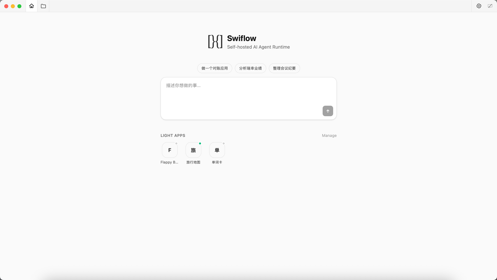
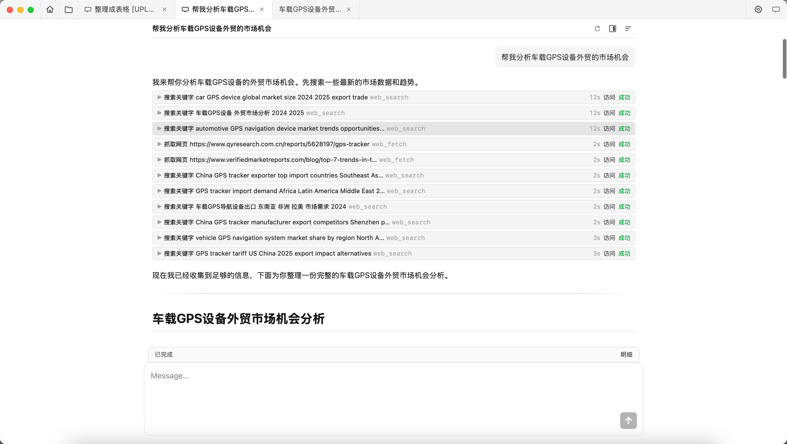
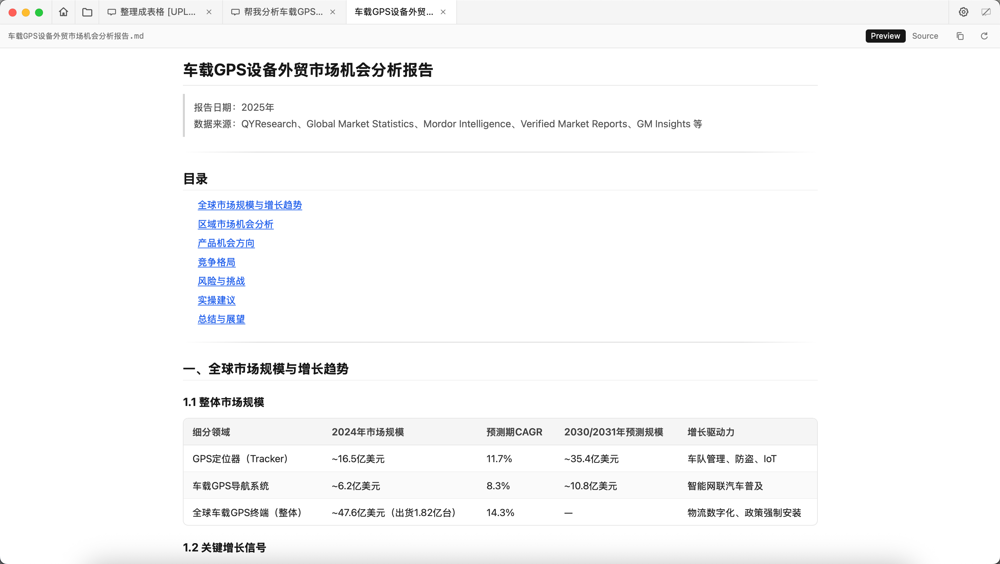
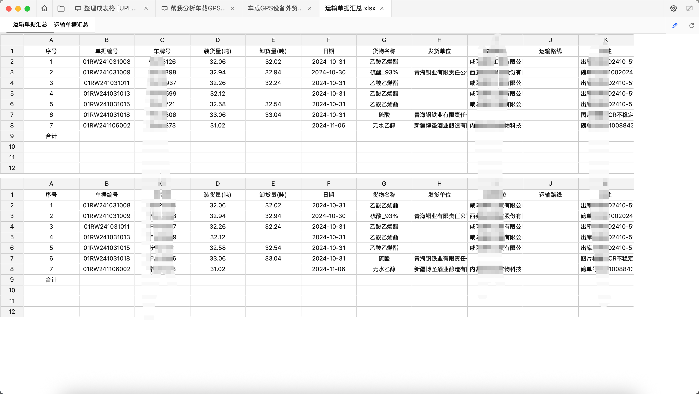
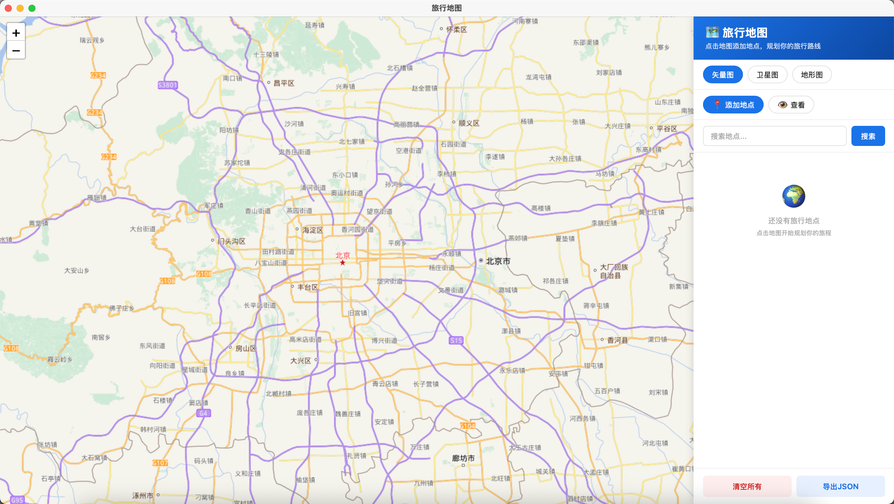
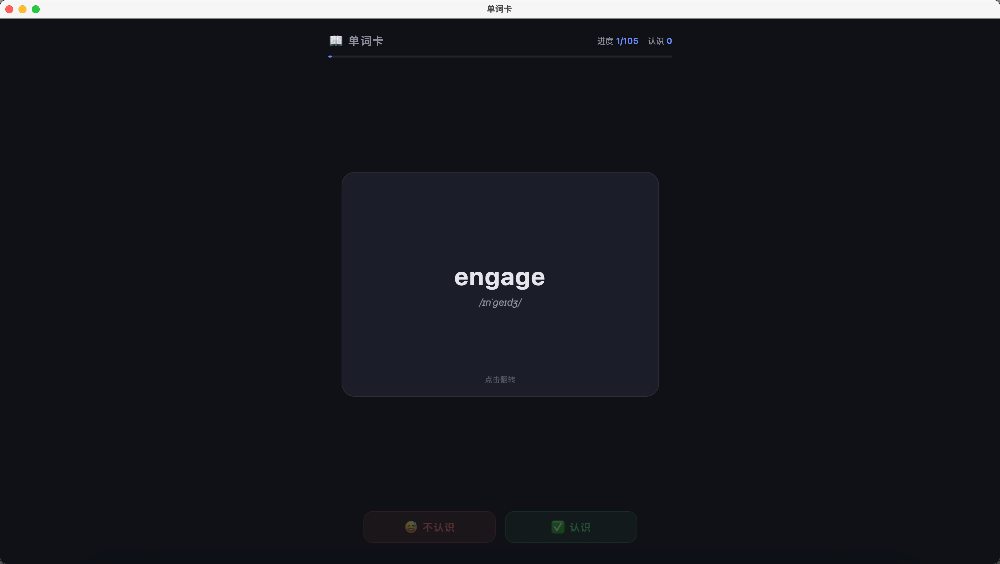

# Swiflow

**自己生成轻应用 + Agent 辅助办公** — 自托管的 AI Agent Runtime。

很多数据处理没法每次都把整表丢给 Agent：你真正需要的是一个**可重复跑的小程序**去做转换、对账、导入导出。另一部分工作适合用 AI 提效——数据整理、市场分析、纪要归纳——这时才需要对话式 Agent。

Swiflow 把这两件事放在一起：

1. **Light Apps（轻应用）** — 用自然语言生成独立小程序，之后直接打开用，不必再过一遍 Agent。
2. **Agent 辅助办公** — 需要调研、整理、分析时，再让 Agent 用工具帮你完成。

单二进制 + Vue UI，数据落本地，对接任意 OpenAI 兼容模型。安装与本地开发见 [`docs/GETTING_STARTED.md`](docs/GETTING_STARTED.md)。

---

## 截图

### 首页 — 快捷输入 + Light Apps 入口

### Agent 辅助办公 — 工具调用与市场分析

### 轻应用 — 对话生成，之后直接打开用

---

## 为什么不是「事事问 Agent」

| | 轻应用（程序） | Agent（对话） |
|--|----------------|---------------|
| **适合** | 固定流程：对账、格式转换、看板、导入校验 | 开放任务：整理、检索、分析、写纪要 |
| **数据怎么走** | 程序读你的文件 / 表，本地转换 | Agent 按需读写 workspace、搜索、浏览 |
| **重复使用** | 做好一次，天天点开跑 | 每次带着新问题聊 |
| **成本与可控** | 不占模型额度；逻辑可见、可改 | 按任务付推理；适合一次性或低频 |

一句话：**能固化成程序的，做成 Light App；还在探索的，交给 Agent。**

---

## 亮点

- **轻应用可沉淀** — 对话生成静态页或 Python 小服务，在桌面子窗口打开，与 workspace 隔离；首页一排图标随时启动。
- **Agent 真能干活** — 文件系统、搜索与抓取、浏览器、Shell、Skills、MCP；不是只会闲聊。
- **两条路径一条产品** — 同一个自托管环境里，既能「做一个对账应用」，也能「分析最近一年业绩」。
- **数据留在自己这边** — SQLite / Postgres，密钥加密；不绑某一家 Agent 云。
- **办公向扩展** — Cron 定时跑 Agent；MCP 接内部系统；Skill 草稿人工确认后再入库。

---

## Features

| 能力 | 说明 |
|------|------|
| **Light Apps** | 自然语言建应用 → 注册 / 启动 / 子窗口打开；重复数据处理的主战场 |
| **Chat & Sessions** | SSE 流式；多标签；历史持久化；运行中可排队追问 |
| **Tools** | `fs_*`、`web_search` / `web_fetch`、`browser`、`exec`、Skills、`clarify`、`todo_*` |
| **Providers** | 任意 OpenAI 兼容 Chat Completions；多 Provider / Agent |
| **MCP** | 外部 MCP Server，工具以 `mcp_<server>_<tool>` 出现 |
| **Cron** | 定时调度 Agent（如 `0 9 * * *`、`@hourly`） |
| **Runtime** | 向导安装 Python+UV、Node+npx，供轻应用与脚本工具使用 |
| **Desktop** | Wails 桌面端；Light App 子窗口；打开数据目录 / 日志 |

---

## 适用场景

### 做成程序（Light Apps）

- **对账 / 校验** — 每月同一套规则，不该每次把全量明细贴进对话。
- **格式转换与导入** — CSV ↔ 内部表、字段映射、简单清洗流水线。
- **个人看板 / 小工具** — 计算器式、清单式、本地 JSON 存储的轻量 UI。

流程大致是：说清需求 → Agent 澄清存储与验收标准 → 生成并自测 → 你之后只打开应用。

### 用 AI 提效（Agent）

- **数据整理** — 杂乱笔记、多份导出，整理成结构化结果与待办。
- **市场 / 业绩分析** — 搜索、抓取、浏览公开信息，汇总结论（如「分析最近一年某品牌业绩」）。
- **会议与知识沉淀** — 纪要、待办、可复用的 Skill 草稿。

### 两者结合

先用 Agent 摸清规则与样例，再让它把稳定部分收成 Light App——探索归对话，日常归程序。

---

## 文档

| 文档 | 内容 |
|------|------|
| [`docs/GETTING_STARTED.md`](docs/GETTING_STARTED.md) | 快速开始 / 构建 / Docker / Skills |
| [`docs/SPEC.md`](docs/SPEC.md) | 产品 / API / Schema 约定与路线图 |
| [`docs/AGENT_ARCHITECTURE.md`](docs/AGENT_ARCHITECTURE.md) | Agent 运行时实现说明 |
| [`docs/AGENT_WORKFLOW_PATTERNS.md`](docs/AGENT_WORKFLOW_PATTERNS.md) | 委派 / 队列 / Clarify / Skill 草稿等模式 |
| [`docs/IMPLEMENTATION_STATUS.md`](docs/IMPLEMENTATION_STATUS.md) | 已落地 vs 延期清单 |
| [`docs/README.md`](docs/README.md) | 文档索引 |

---

## Status

单租户可用（shared-token auth）。多租户 / RBAC 等见 [`docs/SPEC.md`](docs/SPEC.md) 路线图。

---

## 感谢

Swiflow 是 clean-room 实现；架构设计参考了以下开源项目（学习其思路，未复制代码）：

- [hermes-agent](https://github.com/NousResearch/hermes-agent)（MIT）— Agent 循环、Skills、网关形态
- [ZeroClaw](https://github.com/zeroclaw-labs/zeroclaw)（MIT OR Apache-2.0）— 安全加固、沙箱与可观测思路

详见 [`PROVENANCE.md`](PROVENANCE.md)、[`NOTICE.md`](NOTICE.md)。
