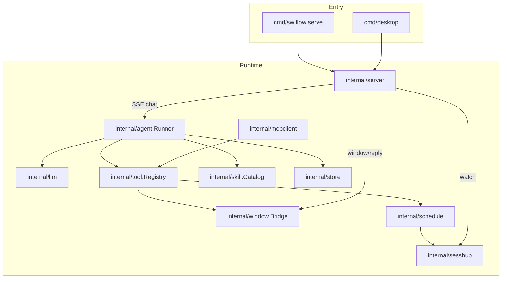

# Swiflow Agent Architecture

> **Authority:** this document describes the **as-implemented** agent runtime.
> Product contracts and historical clean-room scope live in [`SPEC.md`](SPEC.md).
> Where they disagree, prefer this file + the Go sources under `internal/agent`,
> `internal/tool`, `internal/server`, and `cmd/swiflow/serve.go`.

## 1. Overview

Swiflow is a **single-process** agent runtime. HTTP (CLI `swiflow serve` or
desktop Wails) assembles store, tool registry, skills, MCP, cron, window bridge,
and `agent.Runner`. Clients start runs via SSE chat; the Runner drives an
LLM ↔ tools loop until a final answer or a safety wrap-up.

## 2. Wiring (serve / desktop)

Typical assembly order (`cmd/swiflow/serve.go`, mirrored in desktop):

1. Load config → open SQLite store → migrate/seed.
2. Discover skills (`skill.Catalog`).
3. Build `tool.Registry`: `fs_*`, `web_fetch` / `web_search`, `exec` (gated),
   `skill_*`, `browser` (gated), `window_*`, then `schedule_*` after the
   scheduler exists; MCP tools sync as `mcp_<server>_<tool>`.
4. `agent.NewRunner` with store, tools, skills, workspace, history limit.
5. HTTP server: chat SSE calls `Runner.Run`; watch SSE subscribes to `sesshub`;
   `POST /api/window/reply` completes UI RPCs.

Agent definition (`key`, `provider`, `model`, `system_extra`) and provider
credentials live in the **database**, not in `config.json`.

## 3. One run (`Runner.Run`)

Source: [`internal/agent/agent.go`](../internal/agent/agent.go).

### 3.1 Setup

1. **Claim session** — insert `sessionKey` into in-memory `busy` map; if already
   present → emit `error` / return `ErrBusy` (HTTP layer maps to **409**).
2. Register `context.CancelFunc` for `Abort`.
3. Get-or-create session; resolve agent → provider (cached per provider name).
4. Load history; truncate to `max_history_msgs`.
5. **Persist user message immediately** (survives first-round LLM failure).
6. Build messages: system (§3.3) + history + user; tool defs from
   `Registry.Definitions()`.

### 3.2 Round loop (`maxRounds = 32`)

Each round:

1. Optional **nudge** (soft budget / hard fuse / stall wrap-up) appended as a
   synthetic user message; tools may be withheld (`roundTools = nil`).
2. `provider.ChatStream` → emit `thinking` / `delta`.
3. If tool calls and tools allowed:
   - Detect identical tool-call fingerprints; after **3** repeats → set
     `forceWrapUp` (stall), continue (do **not** hard-error).
   - Persist assistant + tool_calls; for each call: emit `tool_call`, execute
     (respect `store.ToolEnabled`), emit `tool_result`, persist truncated result
     (4000 chars).
   - **3 consecutive tool errors** → stall wrap-up next round.
4. Else (no tool calls, or wrap-up with empty tools): persist final assistant,
   set session title if empty (first ~60 chars of first user message), emit
   `done`.

Exhaustion fallback: emit a short `continueHint` + `done`.

### 3.3 Stop policy (goal first, budget last)

| Condition | Behavior |
|-----------|----------|
| Model returns text, no tool calls | Final answer → `done` |
| Same tool-call set 3×, or 3 consecutive tool errors | Forced **no-tool** wrap-up + stall nudge |
| Round ≥ 75% of 32 | Soft nudge: prefer finishing |
| Last round or forced wrap-up | Tools withheld + hard/stall nudge |
| Context cancel / LLM error | `error` terminal |

`maxRounds` is a **runaway fuse**, not the normal completion signal.

### 3.4 System prompt (implemented)

Built by `buildSystem`:

- `You are Swiflow agent <key>.` + optional `system_extra`
- `## Workspace` (if configured)
- `## Skills` — only if `Catalog.Summary` is non-empty (no “No skills available.”
  placeholder)
- `## When to stop` — goal-first guidance
- `## Scheduling` — `schedule_run` / `schedule_create`
- `## Skill authoring` — `skill_manage`

Built-in skill guides: `embed/init-skills/window-context/`, `example/`.

## 4. Concurrency (multi-chat ≈ multi-open)

`Runner.busy` is keyed by **sessionKey**, not global.

| Capability | Supported? |
|------------|------------|
| Different sessions running at once | **Yes** (multi Chat tabs, parallel requests, cron/`schedule_run` on other keys) |
| Same session second run while busy | **No** → 409 / `session busy` |
| Isolated subagent tree / nested spawn | **No** (Phase 2 gap) |
| Global max concurrent runs / FS write mutex | **No** |

Resources (Registry, browser pool, LLM quotas) are **process-shared**. Frontend
opens one Chat tab per session (same session reuses the tab).

## 5. Mid-run user input

**Not supported.**

- UI: while `streaming`, `send()` returns; composer shows Abort.
- API: second `POST /api/sessions/{key}/chat` → **409**.
- No message queue and no “interrupt and continue with new text.”
- User must `Abort` (optional), wait for idle, then send a new message.

## 6. Task verification & self-evolution

**Not first-class product features.**

- No acceptance gate, checklist protocol, or forced verify-before-`done`.
- No autonomous skill/agent evolution pipeline.
- The model may run tests or edit files **if** prompted / tools allow; that is
  prompt-driven behavior.
- `skill_manage` writes user skills when the model chooses to call it — not a
  closed-loop self-improve system.

## 7. SSE channels

| Channel | Path | What it carries |
|---------|------|-----------------|
| Chat | `POST /api/sessions/{key}/chat` | Live `Runner` events for that request only |
| Watch | `GET /api/sessions/{key}/watch` | `sesshub` fan-out (today mainly **scheduled** turns) |
| Window reply | `POST /api/window/reply` | Completes `ui_request` from `window_*` tools (~8s timeout) |

Chat emits do **not** currently Publish into `sesshub`; a watch subscriber does
not see a concurrent live chat on the same session.

Event types from the runner: `delta`, `thinking`, `tool_call`, `tool_result`,
`done`, `error`, plus `ui_request` via the window bridge.

## 8. Tools & config

### 8.1 Built-in tool names (code)

`fs_read`, `fs_write`, `fs_list`, `fs_edit`, `web_fetch`, `web_search`, `exec`,
`browser`, `skill_use`, `skill_search`, `skill_manage`, `schedule_run`,
`schedule_create`, `window_opened`, `window_active`, `window_open`, plus MCP
`mcp_*`.

Config gates: `tools.exec_enabled`, `tools.browser_enabled` /
`browser_headless`. Search: `tools.search_provider` (`duckduckgo` \| `brave` \|
`searxng`; empty = disabled), `search_api_key`, `search_base_url` (env
`SWIFLOW_SEARCH_*`). See [`config.example.json`](../config.example.json).

Enablement is dual-path: registry `disabled` map + DB `tool_policy` checked at
execute time — a known consistency footgun.

### 8.2 Skills

Init (embedded / `init_skills_dir`) + user dir; user overrides by slug.
Summaries inject into system; full body via `skill_use`. Disable via
`skill_disabled` + APIs.

## 9. Known gaps

1. SPEC historically drifted (MaxRounds, stall→error, exec naming, search keys) —
   keep this file + SPEC in sync when changing behavior.
2. Chat stream ≠ sesshub; multi-client sync for live chat is incomplete.
3. Dual tool enable sources.
4. Thin agent tests (no full mock loop coverage).
5. Parallel runs: no global concurrency cap or workspace write serialization.
6. No mid-run input queue; no verify/evolution subsystem.

## 10. Evolution recommendations

Priority order (product + eng):

1. **Contract sync** — keep SPEC ↔ code aligned; add mock provider loop tests
   (stall wrap-up, persist-before-LLM, busy guard).
2. **Unify session events** — optionally Publish chat events to `sesshub` so
   `/watch` mirrors live runs.
3. **Harden multi-open** — optional `max_concurrent_runs`, browser quotas,
   workspace write mutex; document clearly: multi-session ≠ subagent.
4. **Mid-run input** — prefer **(A) queue**: accept user messages while busy,
   start next `Run` after `done`; **(B) interrupt-and-rerun** is richer but
   harder. Do A first.
5. **Subagents** — child run on a dedicated sessionKey (fits existing busy
   model); define budget, event surface, and how the final answer returns to
   the parent.
6. **Task verification** — orchestration policy (e.g. require tests / checklist
   skill before declaring done), not a new core loop primitive.
7. **Self-evolution** — draft skills from trajectories with **human confirm**;
   do not auto-mutate system prompts unattended.
8. **Single tool-policy source** — collapse Registry.disabled vs DB policy.
9. **Observability** — per-round metrics, tool timeouts, configurable window RPC
   timeout.
10. **Later** — Postgres / multi-tenancy, OTel (SPEC Phases 3–4).

## 11. Primary source map

| Area | Path |
|------|------|
| Run loop | `internal/agent/agent.go` |
| LLM stream | `internal/llm/` |
| Tools | `internal/tool/` |
| Skills | `internal/skill/` |
| HTTP + SSE | `internal/server/server.go` |
| Session fan-out | `internal/sesshub/` |
| Window RPC | `internal/window/` |
| Cron / delay | `internal/schedule/` |
| MCP | `internal/mcpclient/` |
| Assemble | `cmd/swiflow/serve.go`, `cmd/desktop/` |
