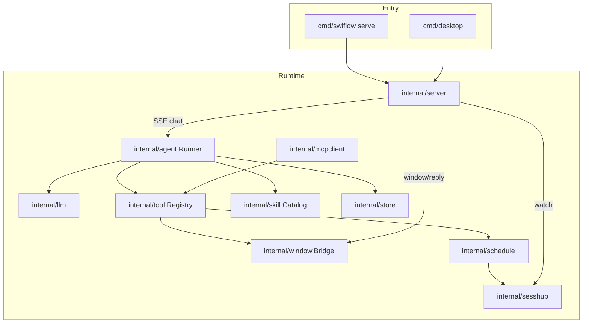

# Swiflow Agent Architecture

> **Authority:** this document describes the **as-implemented** agent runtime.
> Product contracts and historical clean-room scope live in [`SPEC.md`](SPEC.md).
> Where they disagree, prefer this file + the Go sources under `internal/agent`,
> `internal/tool`, `internal/server`, and `cmd/swiflow/serve.go`.

## 1. Overview

Swiflow is a **single-process** agent runtime. HTTP (CLI `swiflow serve` or
desktop Wails) assembles store, tool registry, skills, MCP, cron, window bridge,
and `agent.Runner`. Clients start runs via SSE chat; the Runner drives an
LLM ↔ tools loop until a final answer or a safety wrap-up.

## 2. Wiring (serve / desktop)

Typical assembly order (`cmd/swiflow/serve.go`, mirrored in desktop):

1. Load config → open SQLite store → migrate/seed.
2. Discover skills (`skill.Catalog`).
3. Build `tool.Registry`: `fs_*`, `web_fetch` / `web_search`, `exec` (gated),
   `skill_*`, `browser` (gated), `window_*`, then `schedule_*` after the
   scheduler exists; MCP tools sync as `mcp_<server>_<tool>`.
4. `agent.NewRunner` with store, tools, skills, workspace, history limit.
5. HTTP server: chat SSE calls `Runner.Run`; watch SSE subscribes to `sesshub`;
   `POST /api/window/reply` completes UI RPCs.

Agent definition (`key`, `provider`, `model`, `system_extra`) and provider
credentials live in the **database**, not in `config.json`.

## 3. One run (`Runner.Run`)

Source: [`internal/agent/agent.go`](../internal/agent/agent.go).

### 3.1 Setup

1. **Claim session** — insert `sessionKey` into in-memory `busy` map; if already
   present → return `ErrBusy` (HTTP layer **enqueues** with 202 instead of
   calling `Run`). Optional global `max_concurrent_runs` → `ErrConcurrent` /
   HTTP **409**.
2. Register `context.CancelFunc` for `Abort` (queue is **retained**).
3. Get-or-create session; resolve agent → provider (cached per provider name).
4. Load history; truncate to `max_history_msgs`.
5. **Persist user message immediately** (survives first-round LLM failure).
6. Build messages: system (§3.3) + history + user; tool defs from
   `Registry.Definitions()` (filtered for subagents).
7. Fan-out: every emit also `Publish`es to `sesshub` when configured.

### 3.2 Round loop (`maxRounds = 32`)

Each round:

1. Optional **nudge** (soft budget / hard fuse / stall wrap-up) appended as a
   synthetic user message; tools may be withheld (`roundTools = nil`).
2. `provider.ChatStream` → emit `thinking` / `delta`.
3. If tool calls and tools allowed:
   - Detect identical tool-call fingerprints; after **3** repeats → set
     `forceWrapUp` (stall), continue (do **not** hard-error).
   - Persist assistant + tool_calls; for each call: emit `tool_call`, execute
     under `context.WithTimeout` (`tool_timeout_sec`, default 120s; respect
     `store.ToolEnabled`), emit `tool_result`, persist truncated result
     (4000 chars). Obs: `ToolStart`/`ToolEnd`.
   - **3 consecutive tool errors** → stall wrap-up next round.
4. Else (no tool calls, or wrap-up with empty tools): persist final assistant,
   set session title if empty (first ~60 chars of first user message), emit
   `done`.

Exhaustion fallback: emit a short `continueHint` + `done`.

### 3.3 Stop policy (goal first, budget last)

| Condition | Behavior |
|-----------|----------|
| Model returns text, no tool calls | Final answer → `done` |
| Same tool-call set 3×, or 3 consecutive tool errors | Forced **no-tool** wrap-up + stall nudge |
| Round ≥ 75% of 32 | Soft nudge: prefer finishing |
| Last round or forced wrap-up | Tools withheld + hard/stall nudge |
| Context cancel / LLM error | `error` terminal |

`maxRounds` is a **runaway fuse**, not the normal completion signal.

### 3.4 System prompt (implemented)

Built by `buildSystem`:

- `You are Swiflow agent <key>.` + optional `system_extra`
- `## Workspace` (if configured) — absolute root + `@/` alias (`@/` = workspace root;
  user attachments / mentions map to relative paths for `fs_*`)
- `## Skills` — only if `Catalog.Summary` is non-empty (no “No skills available.”
  placeholder)
- `## When to stop` — goal-first guidance
- `## Scheduling` — `schedule_run` / `schedule_create`
- `## Skill authoring` — `skill_manage` / `skill_draft`
- `## Checklist` — `todo_write` / `todo_read`
- `## Delegation` — `delegate_task` (summary-only child run)

Built-in skill guides: `embed/init-skills/window-context/`, `reflection-loop/`.

## 4. Concurrency (multi-chat ≈ multi-open)

`Runner.busy` is keyed by **sessionKey**, not global. Optional
`max_concurrent_runs` caps the size of `busy` across sessions.

| Capability | Supported? |
|------------|------------|
| Different sessions running at once | **Yes** (multi Chat tabs, parallel requests, cron/`schedule_run` on other keys) |
| Same session second run while busy | **Queued** → HTTP **202** + FIFO; auto `Run` after exit |
| Isolated subagent tree / nested spawn | **Yes** via `delegate_task` (child session; no nested delegate) |
| Global max concurrent runs | **Yes** (`max_concurrent_runs`; 0 = unlimited) |
| FS write mutex | **No** |
| Browser multi-page | **No** — single shared page pool; concurrent gate helps |

Resources (Registry, browser pool, LLM quotas) are **process-shared**. Frontend
opens one Chat tab per session (same session reuses the tab).

## 5. Mid-run user input

**Message queue + Clarify (landed).**

- Queue: while `streaming`, compose still sends → **202** / local “Queued” bubble;
  `/watch` picks up auto-continued turns. Abort keeps queue.
- Clarify: `clarify` tool emits `ui_request`; Chat UI answers via `/api/window/reply`;
  same run continues with the answer as tool result (up to 15 minutes).
- No interrupt-inside-other-tool-calls; queued items are still a fresh later `Run`.

## 6. Task verification & self-evolution

**Soft checklist + draft confirm (landed); no hard gate.**

- `todo_write` / `todo_read` + system nudge for long tasks; completion-before-done
  is **policy**, not a runtime hard stop.
- `skill_draft` → drafts API → Skills UI Accept/Reject → user-skills. **Does not**
  auto-edit `system_extra`.
- `skill_manage` still writes user skills when the model chooses create/patch.

## 7. SSE channels

| Channel | Path | What it carries |
|---------|------|-----------------|
| Chat | `POST /api/sessions/{key}/chat` | Live `Runner` events for that request (idle → SSE; busy → 202) |
| Watch | `GET /api/sessions/{key}/watch` | `sesshub` fan-out (chat emits + scheduled + queue auto-continue) |
| Window reply | `POST /api/window/reply` | Completes `ui_request` from `window_*` tools (~8s timeout) |

Chat emits **Publish** into `sesshub` when `RunnerDeps.Publish` is set; watch
subscribers see live and auto-continued turns.

Event types from the runner: `delta`, `thinking`, `tool_call`, `tool_result`,
`user` (queue drain), `done`, `error`, plus `ui_request` via the window bridge.

## 8. Tools & config

### 8.1 Built-in tool names (code)

`fs_read`, `fs_write`, `fs_list`, `fs_edit`, `web_fetch`, `web_search`, `exec`,
`browser`, `skill_use`, `skill_search`, `skill_manage`, `skill_draft`,
`todo_write`, `todo_read`, `delegate_task`, `clarify`, `schedule_run`, `schedule_create`,
`window_opened`, `window_active`, `window_open`, plus MCP `mcp_*`.

Config gates: `tools.exec_enabled`, `tools.browser_enabled` /
`browser_headless`, `max_concurrent_runs`, `tool_timeout_sec`. Search:
`tools.search_provider` (`duckduckgo` \| `brave` \| `searxng`; empty = disabled),
`search_api_key`, `search_base_url` (env `SWIFLOW_SEARCH_*`). See
[`config.example.json`](../config.example.json).

Enablement is dual-path: registry `disabled` map + DB `tool_policy` checked at
execute time — a known consistency footgun.

### 8.2 Skills

Init (embedded / `init_skills_dir`) + user dir; user overrides by slug.
Summaries inject into system; full body via `skill_use`. Disable via
`skill_disabled` + APIs. Human-reviewed drafts under `user_skills/.drafts/`.

## 9. Known gaps

1. Keep SPEC ↔ this file in sync when changing behavior.
2. Dual tool enable sources.
3. Thin agent tests (no full mock loop / delegate loop coverage).
4. No workspace write serialization; browser pool is single-page.
5. Queue is **in-memory only** (restart drops pending messages).
6. No hard acceptance gate; no OTel export (slog observe only).

## 10. Evolution recommendations

> Concepts: [`AGENT_WORKFLOW_PATTERNS.md`](AGENT_WORKFLOW_PATTERNS.md).

Status vs earlier backlog:

| # | Item | Status |
|---|------|--------|
| 1 | Contract sync / mock loop tests | Ongoing |
| 2 | Unify session events to sesshub | **Done** |
| 3 | `max_concurrent_runs` / tool timeouts / observe | **Done** (FS mutex still open) |
| 4 | Mid-run message queue + clarify | **Done** |
| 5 | Subagents summary-only | **Done** (deepen tool later) |
| 6 | Task verification | Soft todos; hard gate open |
| 7 | Skill draft + human confirm | **Done** |
| 8 | Single tool-policy source | Open |
| 9 | Full OTel | Phase 4 |
| 10 | Postgres / multi-tenancy | Phase 3 |
| — | Queue persistence (SQLite) | Open |

Next priorities: queue durability, harden FS/browser sharing, richer tests.
## 11. Primary source map

| Area | Path |
|------|------|
| Run loop | `internal/agent/agent.go` |
| Observe | `internal/observe/` |
| LLM stream | `internal/llm/` |
| Tools | `internal/tool/` (incl. `delegate.go`, todos, drafts) |
| Skills / drafts | `internal/skill/` |
| HTTP + SSE | `internal/server/server.go` |
| Session fan-out | `internal/sesshub/` |
| Window RPC | `internal/window/` |
| Cron / delay | `internal/schedule/` |
| MCP | `internal/mcpclient/` |
| Assemble | `cmd/swiflow/serve.go`, `cmd/desktop/` |
