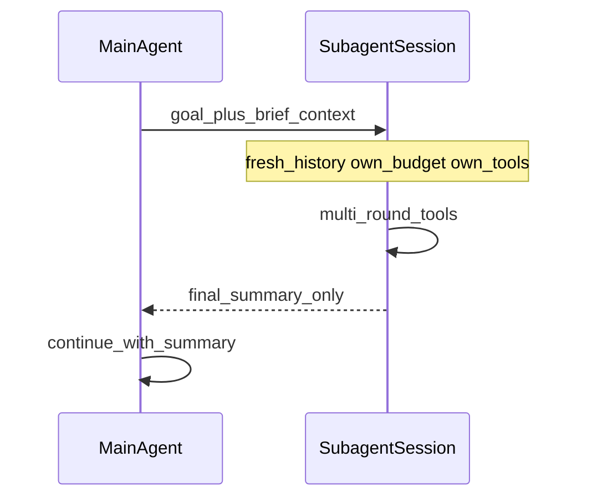
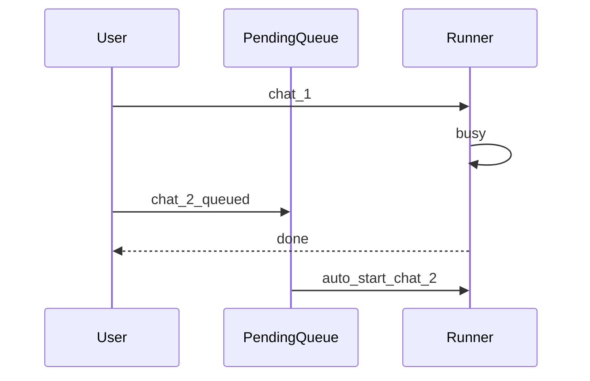

# Agent 工作流机制说明（学习向）

> 本文解释设计概念，**不是**当前实现规格。  
> 现状运行时见 [`AGENT_ARCHITECTURE.md`](AGENT_ARCHITECTURE.md)；产品契约见 [`SPEC.md`](SPEC.md)。  
> 读完应能回答文末「自测题」。

---

## 0. 和 Swiflow 今天的对照

| 能力 | 今天 | 本文讨论的目标形态 |
|------|------|-------------------|
| 多 session 并行 | 有（`busy` 按 sessionKey）+ 可选 `max_concurrent_runs` | 同左；Subagent **复用**该锁粒度 |
| Subagent 委派 | **有**（`delegate_task`，摘要回灌；无读子 session 工具） | 按需加深仍可演进 |
| Running 时再发消息 | **消息队列已落地**（202 + FIFO；Abort 保留队列） | Clarify **已落地**（`clarify` tool） |
| Per-round 观测 / 工具闸 | **有**（`internal/observe` + `tool_timeout_sec`） | 完整 OTel 仍属 Phase 4 |
| Todo / 验收 / skill 进化 | **todo_* + skill_draft 人工确认** | 硬验收闸未做；禁止无人自动改 system_extra |

---

## 1. Subagent：隔离、摘要回灌、按需加深

### 1.1 默认机制

主 agent 把一个**子目标**派给子 agent。子 agent：

- 使用**全新对话历史**（不知道父会话里扯过什么，只知道你写进 `goal` / `context` 的话）；
- 使用**独立 `sessionKey`**（与 Swiflow 现有「一 session 一跑」兼容）；
- 使用**自己的轮次预算**（例如最多 N 轮工具，花不完也不占用父的 32 轮保险丝）；
- 可用工具集往往**更窄**（例如只给 fs + web，不给再委派）。

做完后，**默认只把最终摘要**塞回父 agent 的上下文，父继续主线任务。

### 1.2 「只回摘要」会不会丢信息？

**会丢，而且是故意的。**

丢掉的是：中间每一轮 `tool_call` / `tool_result`、冗长日志、试错过程。  
保留的是：面向目标的结论（做了什么、结论是什么、卡在哪、产出落在哪）。

原因：

1. **Token**：子轨迹可能比摘要长一个数量级，全量并入父上下文会爆窗口。  
2. **注意力**：父任务有自己的主线；塞进大量噪声会干扰后续推理。  
3. **隔离**：子失败/跑偏时，父只看到一句「失败原因」，不会被脏历史污染。

所以「丢信息」≠「信息销毁」。中间过程仍可落在：

- 子 session 的 DB `messages` 里；
- 工作区文件里（工件）；
- 观测日志里。

父**默认不自动加载**这些，而不是系统删光了。

### 1.3 缺细节时怎么加深（三条路）

当摘要不够细，主 agent（或用户）可以**按需**再取，而不是改成「永远全量回灌」：

| 路径 | 做法 | 适合 |
|------|------|------|
| **再委派** | 带着更窄的问题再开一个子 agent（「摘要里第 2 点展开」） | 还要推理/再跑工具 |
| **拉子 session** | 主侧工具按需读取子 session 某几条 message / 某次 tool_result | 偶发核对证据 |
| **工件路径** | 子 agent 把长报告写入 `workspace`，摘要里只写路径；主 `fs_read` | 报表、代码 diff、长文 |

这和 skills 的 **progressive disclosure**（先索引，再 `skill_use` 全文）是同一思路：  
**默认轻量，需要时再加载。**

### 1.4 和「多 Chat 并行」的差别

| | 多 Chat / 多开 | Subagent |
|--|----------------|----------|
| 谁发起 | 用户开多个页签 | 主 agent 工具内委派 |
| 结果怎么用 | 各聊各的 | 摘要必须回到父上下文才算完成委派 |
| 历史 | 各自完整 | 子历史对父默认不可见 |
| 预算 | 各自 32 轮保险丝 | 子有独立更紧的预算更常见 |

Swiflow 今日已有右列 v1（摘要回灌）；「拉子 session」工具仍未做，加深靠再委派或工件路径。

---

## 2. Mid-run：消息队列 vs clarify

### 2.1 今天发生了什么（队列：已落地）

一次 `Runner.Run` 占住某 `sessionKey` 的 `busy`：

- 再 `POST .../chat` → HTTP **202** `{queued, position}`（不再 409，除非全局闸满）；
- UI 在 `streaming` 时仍可发送；Abort 后**保留**队列并继续 FIFO。

Clarify（agent 主动问人）**已落地**：`clarify` tool → `ui_request` → Chat 面板答题 → `window/reply` 续跑。

### 2.2 消息队列（已落地）

**方向：用户 → agent。不打断当前工具轮。**

直观理解：

- Running 时输入框**可以发**；
- 内容进入该 session 的**待办队列**，并立刻提示「已排队」；
- 当前 run `done`（或 Abort 后按策略）再按 FIFO 自动开下一轮 `Run`，把队头当成新的 user 消息。

**不做什么：**

- 不插入当前正在执行的某一轮 LLM/tool 中间改指令；
- 不自动把队列消息拼进「这一轮」的 tool 结果里。

因此语义稳定：每一轮 Run 的边界仍清晰，和现有 persist-user-then-loop 模型兼容。

Abort **保留**队列，空闲后继续 FIFO 自动 `Run`（SPEC / 实现已选定）。

### 2.3 Clarify（已落地）

**方向：agent → 用户。主动问一句再继续。**

典型场景：缺账号、缺二选一、缺确认后再写库。

流程：

1. 模型调用 `clarify` → SSE `ui_request`（name=`clarify`），**tool 内阻塞等待**（最长约 15 分钟）；
2. UI 展示问题与选项/输入；
3. 用户 `POST /api/window/reply` 后 tool 返回 `{"answer":"..."}`，模型在同一轮 `Run` 内继续。

与队列并存：等待 clarify 时 session 仍 busy，用户补充输入进 FIFO，不打断当前 tool 等待。

### 2.4 二者对比与优先级

| | 消息队列 | Clarify |
|--|----------|---------|
| 谁主动 | 用户 | Agent |
| 打断当前 tool 轮？ | 否 | 否（挂起等待，不是插入 tool 中间改指令） |
| 相对今日 409 | 忙时从「拒绝」变为「入队」 | 新增「Ask 人类」产品态 |
| 实现面 | 会话状态机 + 可选自动续跑 | + UI + 协议 + 半态恢复 |
| 优先 | **先做** | 后做 |

「先队列再 clarify」只是工程排序：先解决「我想补充」的高频痛点，再解决「模型想问你」的交互。

**打断续跑（旧文档方案 B）**——Abort 当前轮并立刻用新消息开跑——更猛、更难测，本文不作为首选；队列已覆盖大部分补充意图。

---

## 3. Per-round 观测 + 工具超时 / 并发闸

**已落地（v1）：** `internal/observe` 结构化 `slog`；`tool_timeout_sec`；`max_concurrent_runs`。
完整 OTel/Prometheus 仍属 SPEC Phase 4。

**闸：**

- 单 tool 超时（默认 120s）；
- 进程级 `max_concurrent_runs`；browser 单页池由文档说明 + 全局闸间接保护；
- 多 session 并行时限制过载。

多 session 并行 ≠ Subagent；闸保护的是**机器**，不是委派语义。

---

## 4. Todo / 验收 + skill 草案人工确认

**Todo / 验收（已落地软策略）：**

- `todo_write` / `todo_read` 会话级 checklist；
- 「宣布完成前跑测」靠 system/skill 提示，**非**运行时硬门。

**Skill 草案确认（已落地）：**

1. 模型用 `skill_draft` 写入 `.drafts/`；
2. Skills UI 预览 / Accept / Reject；
3. **禁止**自动改写 agent `system_extra`。

---

## 5. 推荐外部阅读（机制，不抄代码）

- [Hermes — Subagent Delegation](https://hermes-agent.nousresearch.com/docs/user-guide/features/delegation) — 独立上下文、预算、只回摘要。  
- [Hermes — Creating Skills](https://hermes-agent.nousresearch.com/docs/developer-guide/creating-skills) — 技能分层与可沉淀流程。  
- [ZeroClaw — System Architecture / Observe](https://zeroclaw-labs-zeroclaw-41.mintlify.app/concepts/architecture) — Observer / 可替换遥测思路。

---

## 6. 自测题

1. 主 agent 默认只要子 agent **摘要**，丢掉的是什么？三条**按需加深**路径是什么？  
2. **消息队列**与 **clarify** 分别谁主动？会不会打断正在执行的 tool？和今天的 **202 入队**（vs 旧 409）差在哪？

若题 1、2 能口述清楚，本文目标达成。实现状态见 [`IMPLEMENTATION_STATUS.md`](IMPLEMENTATION_STATUS.md)。
