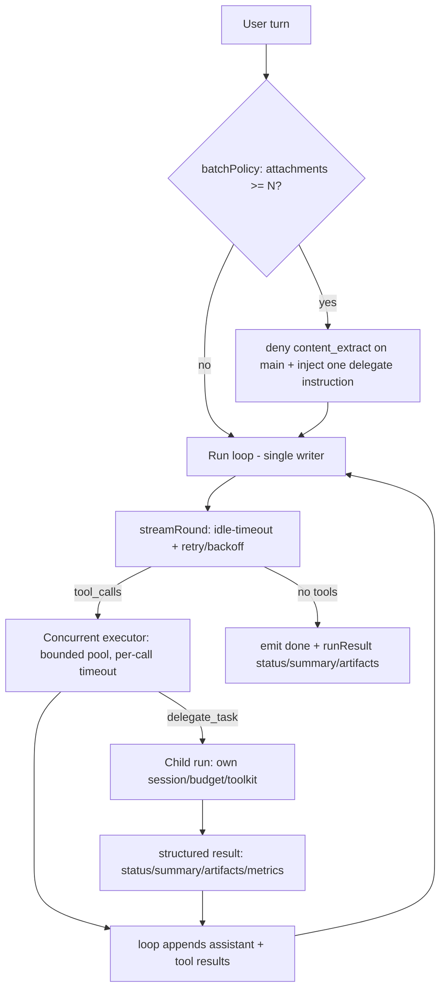

# 并发执行器与结构化委派

> 运行时说明（与代码对齐）。实现主文件：
> - 并发执行器：`internal/agent/executor.go`
> - 主循环（单写者）：`internal/agent/agent.go`
> - 确定性批量路由：`internal/agent/batch_delegate.go`
> - 委派工具：`internal/tool/delegate.go`
> - 内容抽取：`internal/tool/content_extract.go`
> 验证：`go run ./cmd/swiflow eval subagent-exit -c config.json --files 5 --timeout 180`

> 历史说明：早期版本用「软异步（占位/回填/重问）+ EWMA 成本探测」实现同轮并行与长任务隔离。
> 该机制会让 `messages` 被后台 goroutine 并发改写（数据竞争），且行为依赖运行时时延、难以测试。
> 现已删除，改为下面的「并发执行器 + 结构化委派」。`SoftAsyncPlaceholder` 常量仅为兼容旧持久化消息保留，运行时不再产生。

---

## 1. 要解决什么问题

把两个**正交**目标从 LLM 轮次里解耦，各自单一职责：

1. **并行执行工具** —— 一轮内并发跑该轮所有 `tool_calls`。
2. **子会话上下文隔离** —— 长任务交给子运行，父会话只收一条结构化结果。

典型场景：用户一次挂多张图/多份文档，要 OCR + 汇总进 Excel。

| 朴素做法 | 问题 |
|----------|------|
| 主 agent **串行**多次 `content_extract` | 墙钟 ≈ N × 单次 OCR；主上下文塞满长 OCR 文本 |
| 只靠 prompt 叫模型 `delegate_task` | 模型常继续自己抽，不委派 |

---

## 2. 三层解耦



### 2.1 工具执行层：有界并发执行器（`executor.go`）

- 一轮内的所有 `tool_calls`：独立工具**并发**执行（信号量上限 `maxParallelTools = 4`），每个调用独立
  `context.WithTimeout(runCtx, toolTimeout(name))`。
- **全部完成后**才进入下一轮 LLM —— 下一轮永远看到真实结果，不存在占位/回填/重问。
- `tool_call` / `tool_result` 事件仍即时流式（UX 不变）。
- **串行工具**（`delegate_task` / `clarify` / `window_*`）强制顺序执行、独占该轮。
- 单个工具超时或 `ctx` 取消 → 该调用产出一条 error 结果，整轮不被卡死。

### 2.2 轮次层：单写者（`agent.go` `run()`）

- LLM 轮是 `messages` 的纯函数；`messages`（`llmMsgs`）**只由运行循环这一个 goroutine 写入**。
- 从设计上消除数据竞争（`go test -race` 干净）。
- LLM 出错的兜底（保持不变）：
  - 瞬时错误：同轮重试一次（`maxLLMRetries = 1`）。
  - 若已产出工具工作：写入一条诚实的中文总结、`emit done`、以 `status=error` 终态退出（**不丢已完成结果**）。这是子 agent 在 LLM 停滞时仍能干净退出的关键。
  - 没有任何工具工作：直接把错误抛给上层。
- 终态 `runResult{status, summary, artifacts, rounds, toolCalls, failures}`：
  - `done`：模型自然收尾；
  - `budget`：轮次预算耗尽；
  - `stall`：重复工具/连续报错触发提前收尾；
  - `error`：LLM 终态错误但已保存工具工作。

### 2.3 委派层：结构化子运行（`delegate.go` + `RunChild`）

- 子运行拥有独立 session / 轮次预算 / 工具策略（禁嵌套 `delegate_task`、`clarify`）。
- `RunChild` 一律**终态**返回 `tool.ChildResult{Status, Summary, Artifacts, Metrics, Err}`，绝不裸 error 丢工作。
- `delegate_task` 回灌父会话的是一条结构化 JSON：
  ```json
  {"child_session":"…","status":"done|budget|stall|error|blocked",
   "summary":"…","artifacts":["@/out/report.xlsx"],
   "metrics":{"rounds":6,"tool_calls":12,"failures":1}}
  ```
  失败也能拿到「5 张成功、xlsx 未写」这类部分信息；大产物留在 workspace 文件里，用 `@/` 路径引用，父上下文保持干净。
- 并行委派：一轮内多个 `delegate_task` 由执行器直接并行（作为串行工具会独占该轮，但多个委派仍在同一执行器批次内）。

---

## 3. 确定性批量路由（`batch_delegate.go`）

不再用 EWMA/成本探测；改为对**请求本身**的纯函数判定，首轮前一次性生效、可单测：

- `shouldForceBatchDelegate(userMessage, childRun)`：非子运行且附件数
  `countAttachedAtPaths(userMessage) >= batchDelegateThreshold (=3)` → 命中。
- 命中后（本 run 内一次）：
  1. `denyContentExtract(&opts)` —— 主端禁用 `content_extract`；
  2. 注入 `batchDelegateNudge(paths)` —— 列出全部 `@/` 路径，要求主端**一次** `delegate_task` 全量交给子 agent 写 xlsx。
- 子运行永不触发（子无法委派）。

---

## 4. 统一超时/预算（`executor.go` `toolTimeout` + `RunOpts`）

- `Runner.toolTimeout(name)` 是**单一来源**：
  - `RunnerDeps.ToolTimeouts[name]` 优先（运行时把 `content_extract` 对齐到 `DocumentTimeout + 30s` 余量，让 provider 的 HTTP 超时先报错，而非被 tool ctx 生硬取消）；
  - `clarify` / `delegate_task` 用 15min；
  - 否则回落 `ToolTimeoutSec`（默认 120s）。
  - 消除了旧的 `ToolTimeoutSec(120s)` 与 `DocumentTimeout(180s)` 双超时打架。
- `RunOpts.MaxWallClock` / `ChildRunOpts.MaxWallClock`：子运行可有独立墙钟预算，与父的 tool timeout 解耦。

---

## 5. 停滞/重试保护

- **LLM 客户端**（`internal/llmclient/openai.go`）：
  - SSE 空闲守护 `streamWithIdleGuard`（`streamIdleTimeout = 60s`）：收到 header 后正文停滞即中止并报错。
  - `429/5xx/停滞/网络` 指数退避重试（`llmMaxRetries=2`，仅在**尚未流出任何内容**时重试，避免重复输出）；`400/401/403` 视为致命（`APIError` 按状态码分类）。
- **OCR/vision provider**（`library/document/providers/*.go`）：
  - 统一走 `library/httputil` 的 transport（代理感知 + `ResponseHeaderTimeout`）。
  - 用 `httputil.NewIdleReadCloser`（`ocrIdleTimeout = 60s`）守护「header 已回、正文停滞」的挂起。

---

## 6. 数据流与 UI

| 层 | 工具执行 | 委派 |
|----|----------|------|
| Store | 每个 `tool_result` 由循环单写者落库 | 子 session 独立消息；父收一条结构化 tool 结果 |
| SSE | `tool_call`/`tool_result` 即时流式 | 子事件在子 session；父看 `delegate_task` 结果 |
| WebUI | `ToolCallBlock` 正常展示调用/结果 | 正常展示 `delegate_task` 调用块 |

---

## 7. 验证方式

```bash
# 子 agent 干净退出（LLM 停滞/超时也应终态退出，emit done）
go run ./cmd/swiflow eval subagent-exit -c config.json --files 5 --timeout 180

# 竞争检测（messages 单写者，应无竞争）
go test -race ./internal/agent/...
```

---

## 8. 相关代码索引

| 文件 | 内容 |
|------|------|
| `internal/agent/executor.go` | 有界并发执行器、`toolTimeout`、单调用执行 |
| `internal/agent/agent.go` | 主循环（单写者）、`runResult`、LLM 错误优雅退出、`RunChild` |
| `internal/agent/batch_delegate.go` | 附件路径解析、确定性 `shouldForceBatchDelegate`、nudge、artifacts 提取 |
| `internal/tool/delegate.go` | `delegate_task`、`ChildResult`/`ChildMetrics` |
| `internal/tool/content_extract.go` | OCR / 内容抽取 |
| `internal/llmclient/openai.go` | SSE 空闲守护、`APIError`、退避重试 |
| `library/httputil/idle.go` | `NewIdleReadCloser` 正文停滞守护 |
| `cmd/swiflow/eval_subagent_exit.go` | `subagent-exit` 评测 |
| `webui/src/components/ToolCallBlock.vue` | 工具调用/结果展示 |
